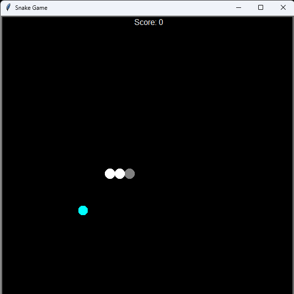
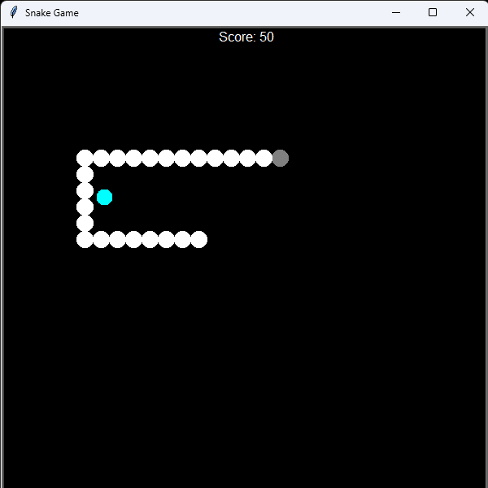
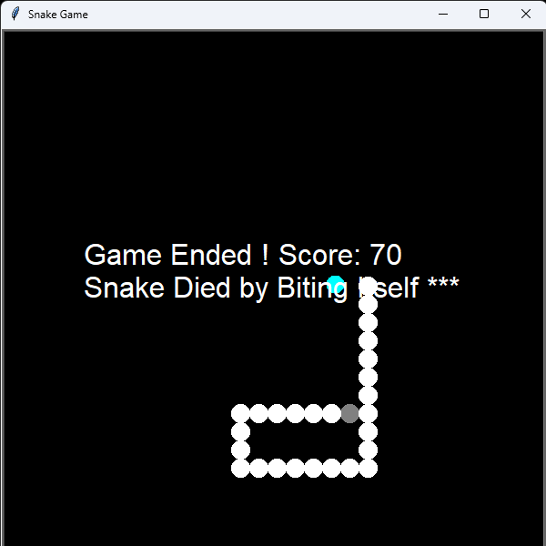
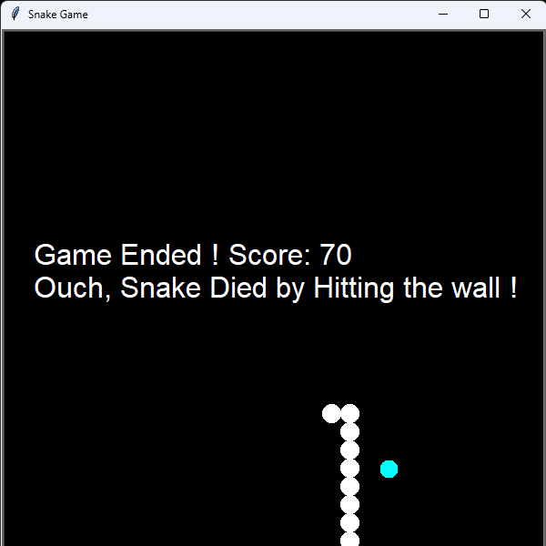

# 🐍 Snake Game - Python Turtle Implementation

A fun and classic **Snake Game** built using Python and Turtle graphics, created as part of a **Python programming project**.

## Download Link
https://preetam-06.itch.io/snake-game-python
---

## 📋 Project Overview

The Snake Game is a popular arcade game where the player controls a snake to eat food and grow longer, while avoiding collisions with the walls and itself.

### Game Objective:

* Eat as much food as possible to increase your score.
* Control the snake's direction using keyboard keys.
* Avoid crashing into walls or your own body — or it's game over!

---

## 🚀 Features

* **Smooth Gameplay:** Responsive snake movement.
* **Dynamic Growth:** Snake grows longer as it eats food.
* **Score Tracking:** Displays current score during gameplay.
* **Collision Detection:** Game ends on hitting the wall or itself.
* **Keyboard Controls:** Intuitive controls using W, A, S, D keys.
* **Modular Code Structure:** Well-organized and easy to extend.

---


### 🛠️ Language & Libraries

* **Python 3.7+**
* **Turtle** (Python’s built-in graphics library)

### Dependencies

* No external libraries required — works with built-in Python modules.

---

## 📁 Project Structure

```
Snake_Game_Python/
├── src/
│   ├── Main_Code.py            # Renamed from Main_Code
│   ├── Score_File.py           # Renamed from Score_File
│   ├── Snake_File.py           # Renamed from Snake_File
│   ├── Snake_Food_File.py            # Renamed from Snake_Food_File
├── assets/                # Images and screenshots go here
│   ├── Snake_Game_01.png
│   ├── Snake_Game_02.png
│   ├── Snake_Game_Bite_itself.png
│   ├── Snake_Game_Hit_Wall.png
├── README.md
├── requirements.txt
├── .gitignore             
└── .gitattributes         

```

---

## 🔧 Installation & Setup

### Prerequisites

* Python 3.7 or higher
* Turtle module installed (included by default with Python)

### Setup Instructions

1. **Clone the Repository**

   ```bash
   git clone https://github.com/Preetam/Snake_Game_Python.git
   cd Snake_Game_Python
   ```

2. **(Optional) Create a Virtual Environment**

   ```bash
   python -m venv venv
   source venv/bin/activate  # Windows: venv\Scripts\activate
   ```

3. **Run the Game**

   ```bash
   cd game
   python main.py
   ```

---

## 🎮 How to Play

1. **Start the Game**

   Run `main.py` to launch the game window.

2. **Control the Snake**

   * **W** → Move Up
   * **A** → Move Left
   * **S** → Move Down
   * **D** → Move Right

3. **Gameplay Rules**

   * Eat food to grow the snake and increase your score.
   * Avoid crashing into walls or your own body.
   * The game ends when a collision occurs.

---

## 🧮 Concepts Demonstrated

* **Object-Oriented Programming:** Classes used for Snake, Food, and Scoreboard.
* **Modular Code Design:** Organized project structure for scalability.
* **Event Handling:** Keyboard inputs to control game actions.
* **Collision Detection:** Logic to detect and handle game-ending conditions.
* **Simple Game Development:** Use of Turtle graphics for animation.

---

## 🐛 Troubleshooting

### Common Issues & Solutions

| Issue                     | Solution                                                     |
| ------------------------- | ------------------------------------------------------------ |
| Game window does not open | Verify Python and Turtle installation.                       |
| Controls not responding   | Ensure game window is focused.                               |
| Turtle module not found   | Make sure you're using standard Python, not a minimal build. |

---

## 👨‍🎓 Author

**Preetam Prajapati**
* Python Programming Project
* Computer Science - UnderGrad

---

## 📄 License

This project is intended for educational.
Feel free to explore, modify, and expand it!

---

##  Acknowledgments

* Classic **Snake Game** arcade inspiration.
* Python Turtle Documentation.
* Python Programming Course.

---

### 📷 Screenshots

Take a look at how the game looks in action! 🎮🐍

### 🟢 Game Start
<a href="assets/Snake_Game__01.png">  </a>

### 🍎 Eating Food and Growing
<a href="assets/Snake_Game__02.png">  </a>

### 💀 Game Over – Bite Itself
<a href="assets/Snake_Game_Bite_itself.png">  </a>

### 💥 Game Over – Hit Wall
<a href="assets/Snake_Game_Hit_Wall.png">  </a>

# Python_Turtle_Project
Moderate Python-Turtle Based Game
